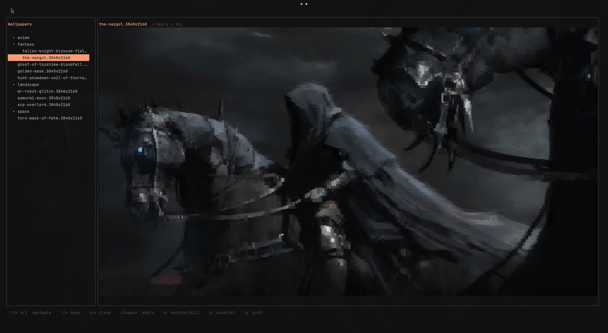
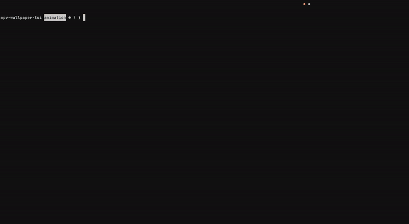
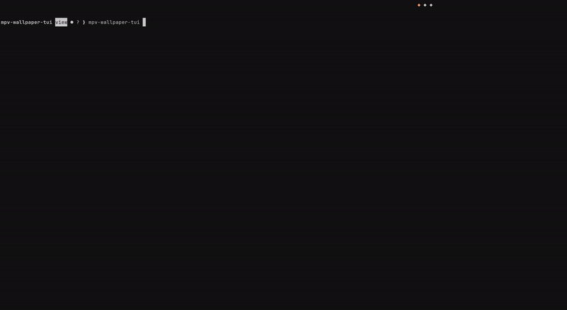

# mpv-wallpaper-tui

A terminal UI for browsing and applying animated video wallpapers via [mpvpaper](https://github.com/GhostNaN/mpvpaper).



## Views

### List view

Browse wallpapers in a folder tree with an animated preview panel on the right.



### Grid view

Press `tab` to switch to a thumbnail grid. Navigate with `hjkl`, press `tab` again to switch back.



## Dependencies

### Runtime

| Tool | Required | Purpose |
|------|----------|---------|
| [mpvpaper](https://github.com/GhostNaN/mpvpaper) | yes | Renders video wallpapers on Wayland outputs |
| [ffmpeg](https://ffmpeg.org) | yes | Extracts frames for preview and animation |
| [chafa](https://hpjansson.org/chafa/) | no | Higher-quality terminal image rendering |

If `chafa` is on your `$PATH` it is used for previews; otherwise the app falls back to a built-in half-block Unicode renderer that requires no extra tools.

**Arch Linux:**
```bash
sudo pacman -S mpv ffmpeg chafa
yay -S mpvpaper   # AUR
```

### Build

- [Go](https://go.dev) 1.22 or later

## Build & Install

Clone and install to `~/.local/bin` in one step:

```bash
git clone <repo-url>
cd mpv-wallpaper-tui
make install
```

`make install` builds the binary and places it at `~/.local/bin/mpv-wallpaper-tui`.
`~/.local/bin` is the XDG-standard per-user binary directory and is on `$PATH` by default on most modern Linux distributions.

Other targets:

```bash
make build      # build only, outputs ./mpv-wallpaper-tui
make uninstall  # remove from ~/.local/bin
```

### Autostart on login

To restore your last wallpaper automatically on login:

```bash
make install-autostart
```

This detects the best method for your system:

| Condition | Method used |
|-----------|-------------|
| systemd user session running (`/run/user/UID/systemd` exists) | systemd user service (`~/.config/systemd/user/mpv-wallpaper.service`) |
| No systemd user session | XDG autostart entry (`~/.config/autostart/mpv-wallpaper.desktop`) |

Both methods run `mpv-wallpaper-tui --restore` once at session start to reapply the last selected wallpaper.

To remove:

```bash
make uninstall-autostart
```

You can also install each method explicitly:

```bash
make install-service    # systemd only
make uninstall-service

# XDG autostart works on any DE that implements the XDG autostart spec
# (GNOME, KDE, XFCE, and Wayland compositors paired with dex or similar)
install -Dm644 mpv-wallpaper.desktop ~/.config/autostart/mpv-wallpaper.desktop
```

## Usage

```bash
mpv-wallpaper-tui
```

### List view

| Key | Action |
|-----|--------|
| `↑` / `k` | Move up |
| `↓` / `j` | Move down |
| `→` / `l` | Open folder |
| `←` / `h` | Close folder / go to parent |
| `↵` / `space` | Apply selected wallpaper |
| `tab` | Switch to grid view |
| `m` | Open monitor selector |
| `a` | Toggle preview animation on/off |
| `q` / `Ctrl+C` | Quit |

### Grid view

| Key | Action |
|-----|--------|
| `h` / `j` / `k` / `l` | Navigate left / down / up / right |
| `gg` | Jump to first wallpaper |
| `G` | Jump to last wallpaper |
| `↵` / `space` | Apply selected wallpaper |
| `tab` | Switch back to list view |
| `m` | Open monitor selector |
| `a` | Toggle preview animation on/off |
| `q` / `Ctrl+C` | Quit |

### Monitor selector (`m`)

| Key | Action |
|-----|--------|
| `↑` / `k` | Move up |
| `↓` / `j` | Move down |
| `↵` / `space` | Confirm selection |
| `esc` / `m` / `q` | Cancel |

Applying a wallpaper kills any running `mpvpaper` instance and starts a new one.
The wallpaper keeps playing after you quit the TUI.

## Configuration

On first launch the app creates its config directory automatically.

### Directory layout

```
~/.config/mpv-wallpaper-tui/
├── config.toml      # application config
└── wallpapers/      # default wallpaper directory
```

### config.toml

```toml
# Path to the directory containing wallpaper video files.
wallpapers_path = "~/.config/mpv-wallpaper-tui/wallpapers"

# Enable preview animation on startup.
animation = true

# Which view to open on launch: "list" or "grid".
default_view = "list"

# Colour overrides — ANSI index (e.g. "2") or hex (e.g. "#ffa07a").
# Leave empty to follow your terminal's ANSI palette.
[colors]
accent = ""
muted  = ""
```

| Option | Default | Description |
|--------|---------|-------------|
| `wallpapers_path` | `~/.config/mpv-wallpaper-tui/wallpapers` | Directory scanned for video files |
| `animation` | `true` | Whether preview animation is enabled on startup |
| `default_view` | `"list"` | View shown on launch: `"list"` or `"grid"` |
| `colors.accent` | `""` | Highlight colour — ANSI index (`"2"`) or hex (`"#ffa07a"`). Empty = terminal default |
| `colors.muted` | `""` | Dimmed text colour — ANSI index (`"240"`) or hex. Empty = terminal default |

`wallpapers_path` supports `~/` expansion. Supported video formats: `.mp4`, `.mkv`, `.webm`, `.avi`, `.mov`.

The `wallpapers/` directory is created automatically if it does not exist. Drop your video files there and relaunch.
